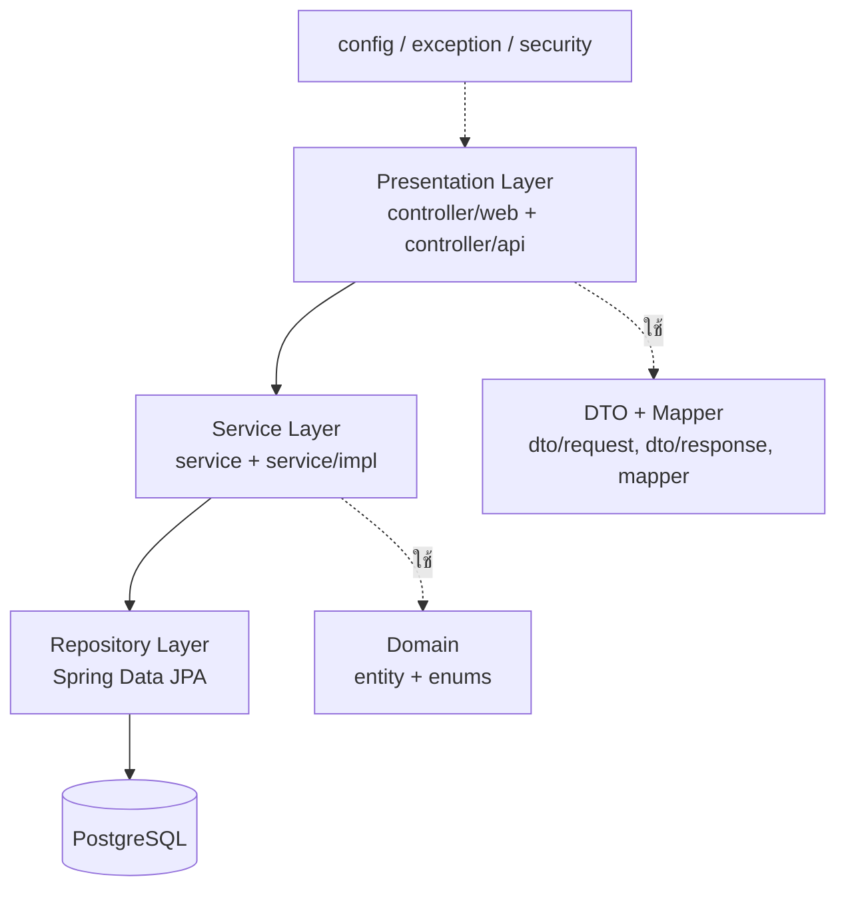
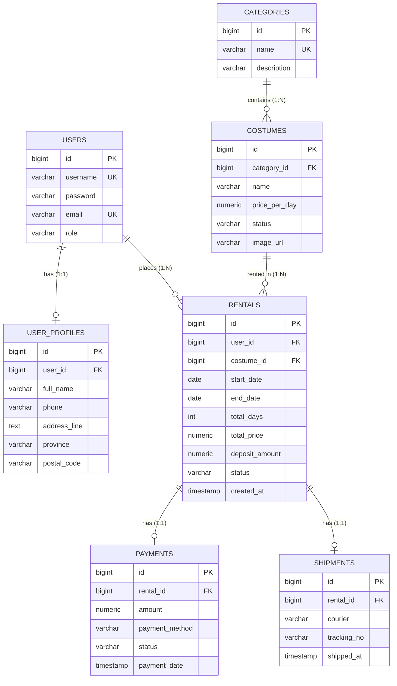

# 🎭 Costume Rental System (ระบบบริหารจัดการเช่าชุดออนไลน์)

ระบบเช่าชุดออนไลน์พัฒนาด้วย **Spring Boot 3 + Thymeleaf + PostgreSQL** ผู้ใช้ค้นหาชุด เลือกวันเช่า ระบบคำนวณราคาและค่ามัดจำให้อัตโนมัติ
จากนั้นแจ้งชำระเงิน ติดตามเลขพัสดุ และดูประวัติการเช่าได้ ส่วนผู้ดูแลระบบจัดการชุด หมวดหมู่ การจัดส่ง และการรับคืนชุด
ระบบมีทั้งหน้าเว็บ (Thymeleaf) และ REST API (`/api/v1/...`) พร้อม Swagger UI โดยใช้ Layered Architecture, SOLID และ Design Patterns
(Strategy, State, Observer, Factory ฯลฯ — ดูรายละเอียดใน `doc/design-patterns.md`)

## สมาชิกกลุ่ม

| ลำดับ | ชื่อ-นามสกุล | รหัสนักศึกษา | Section | Branch | หน้าที่รับผิดชอบ |
| :---: | :--- | :---: | :---: | :--- | :--- |
| 1 | นางสาวศศิวิตรา วงศ์รุ่งอรุณเลิศ | 673380602-6 | 3 | `sasiwitra_673380602-6_03` | พัฒนา Backend และ REST API: Service Layer, Rental System, Exception Handling, Swagger/OpenAPI และ Design Patterns พร้อมเชื่อม Controller กับ Service |
| 2 | นางสาวธันยพร เสนาโนฤทธิ์ | 673380587-6 | 3 | `tanyaporn_6733805876_03` | จัดโครงสร้างโปรเจกต์, ตั้งค่า PostgreSQL & Flyway, สร้าง Entity/DTO/Mapper/Exception, ระบบแจ้งชำระเงิน, หน้าเว็บ Thymeleaf และ Deployment |
| 3 | นางสาวทัดพิชา วะสาร | 673380584-2 | 3 | `Thadpeecha_673380584-2_03` | ออกแบบฐานข้อมูล พัฒนา Business Logic (Service/JPA) และตั้งค่า Spring Security |

---
## Deployment URL
link deploy: https://principle-project.onrender.com
---

## 🌟 ฟีเจอร์หลักของระบบ (Key Features)

### 1. 🔐 ระบบยืนยันตัวตนและความปลอดภัย (Authentication & Security)
* **เข้าสู่ระบบ / สมัครสมาชิก:** รองรับการยืนยันตัวตนด้วย Spring Security
* **การแบ่งสิทธิ์ผู้ใช้งาน (Role-based Access Control):** 
  * **Guest:** เข้าดูรายการชุดเช่าและรายละเอียดได้
  * **User:** ดำเนินการเช่าชุด ติดตามออเดอร์ และแก้ไขข้อมูลส่วนตัว
  * **Admin:** เข้าถึงระบบจัดการหลังบ้าน (Admin Dashboard)
* **ระบบรีเซ็ตรหัสผ่าน (Forgot & Reset Password):**
  * ขอรหัสยืนยัน OTP ผ่านระบบ
  * ยืนยัน OTP เพื่อตั้งรหัสผ่านใหม่ได้อย่างปลอดภัย

---

### 2. 👗 ระบบสำหรับผู้ใช้งาน/ลูกค้า (User Features)
* **หน้ารายการชุดเช่า (Costume Catalog):** แสดงรายการชุดเช่าทั้งหมด พร้อมหมวดหมู่ ราคา และสถานะความพร้อม
* **ดูรายละเอียดชุด (Costume Detail):** แสดงรูปภาพ รายละเอียดชุด ราคาเช่า ค่ามัดจำ และสถานะชุด
* **ทำรายการเช่าชุด (Rental Process):** กรอกข้อมูลวันเริ่มเช่า-วันคืน พร้อมคำนวณราคารวมอัตโนมัติ
* **ติดตามสถานะการเช่า (Order Tracking):** ตรวจสอบประวัติการเช่า สถานะออเดอร์ และเลขพัสดุ (Tracking Number)
* **จัดการข้อมูลส่วนตัว (User Profile):** ดูและอัปเดตข้อมูลส่วนตัว (ชื่อ, อีเมล, เบอร์โทรศัพท์, ที่อยู่)

---

### 3. 🛠 ระบบสำหรับผู้ดูแลระบบ (Admin Features)
* **แดชบอร์ดสรุปภาพรวม (Admin Dashboard):** แสดงรายการเช่าและสถานะชุดทั้งหมดในระบบ
* **จัดการข้อมูลชุดเช่า (Costume Management):**
  * เพิ่มชุดเช่าใหม่ พร้อมอัปโหลดรูปภาพสินค้า
  * แก้ไขข้อมูลชุด ราคา ค่ามัดจำ และสถานะ
  * ลบข้อมูลชุดเช่าออกจากระบบ
* **จัดการการจัดส่งพัสดุ (Parcel & Tracking Management):** อัปเดตชื่อบริษัทขนส่งและเลข Tracking Number ให้กับออเดอร์ลูกค้า
* **ระบบรับคืนชุด (Costume Return):** บันทึกการรับคืนชุดเช่าเมื่อลูกค้าส่งชุดกลับ และคืนสถานะชุดให้พร้อมเช่าใหม่

---

## 🛠️ เทคโนโลยีที่ใช้ (Tech Stack)

* **Backend:** Java (JDK 17/21), Spring Boot (Spring Web, Spring Data JPA, Spring Security)
* **Frontend:** Thymeleaf, HTML5, CSS3, JavaScript, Bootstrap
* **Database:** PostgreSQL / MySQL
* **Build Tool:** Maven

---

## 📂 โครงสร้างโปรเจกต์ (Project Structure)

```text
Principle-project/
├── code/                       # Source code + Configuration (Maven project)
│   ├── pom.xml
│   └── src/main/
│       ├── java/com/example/costumerentalsystem/
│       │   ├── config/         # Security, Web, OpenAPI, AdminSeeder
│       │   ├── controller/
│       │   │   ├── api/        # RestController (/api/v1/...)
│       │   │   └── web/        # Thymeleaf Controller
│       │   ├── service/        # Interface + impl/ + pricing/ + state/ + event/
│       │   ├── repository/     # Spring Data JPA
│       │   ├── domain/         # entity/ + enums/
│       │   ├── dto/            # request/ + response/
│       │   ├── mapper/         # Entity <-> DTO
│       │   └── exception/      # GlobalExceptionHandler + Custom Exceptions
│       └── resources/          # templates/, static/, db/migration (Flyway), application.properties
├── test/                       # การทดสอบและ Test Report
├── doc/                        # เอกสารทั้งหมด
│   ├── diagrams/               # Use Case, Domain, Class, Sequence, Activity, ER, Component, Deployment, State
│   ├── slide/                  # สไลด์นำเสนอ
│   ├── solid-analysis.md
│   ├── design-patterns.md
│   └── data-dictionary.md
├── img/                        # ไฟล์มัลติมีเดีย
├── Dockerfile
├── docker-compose.yml
└── .env.example
```

---
## 🚀 วิธีการติดตั้งและใช้งาน (Getting Started)

### 1. Prerequisites
* Java Development Kit (JDK) 17 ขึ้นไป
* Maven
* PostgreSQL / MySQL Database

---

### 2. ตั้งค่า Database
แก้ไขไฟล์ `src/main/resources/application.properties` ให้ตรงกับฐานข้อมูลของคุณ:

```properties
spring.datasource.url=jdbc:postgresql://localhost:5432/costume_db
spring.datasource.username=postgres
spring.datasource.password=your_password
spring.jpa.hibernate.ddl-auto=update
```
3. รันโปรเจกต์
เปิด Terminal ในโฟลเดอร์โปรเจกต์แล้วรันคำสั่ง:

```Bash
./mvnw spring-boot:run
```
เปิด Browser แล้วเข้าไปที่: http://localhost:8081


## Tech Stack

| ส่วน | เทคโนโลยี |
| :--- | :--- |
| Backend | Java 21, Spring Boot 3.2.5 (Web, Data JPA, Security, Validation, Mail) |
| Frontend | Thymeleaf, HTML5, CSS3, JavaScript |
| Database | PostgreSQL 15+ (Migration ด้วย Flyway) |
| API Docs | springdoc-openapi 2.5.0 (Swagger UI) |
| Testing | JUnit 5, Mockito, Spring Boot Test, Spring Security Test, H2 (โปรไฟล์ test) |
| Build | Maven (Maven Wrapper) |
| Deployment | Docker, Docker Compose, Render |

## System Architecture



กฎของสถาปัตยกรรม: Controller เรียกได้เฉพาะ Service (ห้ามเรียก Repository ตรง) และ Service ขึ้นกับ Interface ทุกตัว
รวมถึงใช้ Constructor Injection เท่านั้น

- **Patterns หลัก:** Layered, MVC, Repository, Service Layer, DTO + Mapper, Dependency Injection
- **GoF (Behavioral):** Strategy (`service/pricing`), State (`service/state`), Observer (`service/event`)
- รายละเอียดและเหตุผลอยู่ใน `doc/design-patterns.md` และ `doc/solid-analysis.md`

## Database Design (ER Diagram)

7 ตาราง: มี One-to-One (`users`–`user_profiles`, `rentals`–`payments`, `rentals`–`shipments`) และ One-to-Many
(`categories`→`costumes`, `users`→`rentals`, `costumes`→`rentals`) พร้อม Foreign Key, Unique, Check Constraint และ Index
ตารางสร้างด้วย Flyway (`code/src/main/resources/db/migration`)



ดูรายละเอียดทุกคอลัมน์ใน `doc/data-dictionary.md` และ `doc/diagrams/er-diagram.md`

## Installation & Setup

**สิ่งที่ต้องมี:** JDK 21, Maven (หรือใช้ `mvnw` ในโปรเจกต์), PostgreSQL 15+ หรือ Docker

1. โคลนโปรเจกต์

   ```bash
   git clone https://github.com/tanyapornsenanorit-code/Principle-project.git
   cd Principle-project
   ```

2. คัดลอก `.env.example` เป็น `.env` แล้วตั้งค่า (ห้าม commit ไฟล์ `.env`)

   | ตัวแปร | ความหมาย |
   | :--- | :--- |
   | `DB_URL` | JDBC URL เช่น `jdbc:postgresql://localhost:5432/principlesproject` |
   | `DB_USERNAME` / `DB_PASSWORD` | ผู้ใช้และรหัสผ่านฐานข้อมูล |
   | `ADMIN_USERNAME` / `ADMIN_PASSWORD` / `ADMIN_EMAIL` | บัญชีแอดมินคนแรก (สร้างโดย `AdminSeeder`) |
   | `MAIL_USERNAME` / `MAIL_PASSWORD` | อีเมลและ App Password สำหรับส่ง OTP/แจ้งเตือน |

3. Schema ถูกสร้างโดย Flyway อัตโนมัติ (`spring.jpa.hibernate.ddl-auto=validate` ไม่ใช่ `update`)

## How to Run

**วิธีที่ 1 — Docker Compose (แนะนำ)** รันที่ root ของ repo

```bash
docker compose up --build
```

เปิด <http://localhost:8080> (หยุดด้วย `docker compose down`, ลบข้อมูลฐานข้อมูลด้วย `docker compose down -v`)

**วิธีที่ 2 — รันตรงด้วย Maven** (ต้องมี PostgreSQL ที่ตั้งค่าไว้ตามขั้นตอนข้างบน)

```bash
cd code
./mvnw spring-boot:run        # Windows: mvnw.cmd spring-boot:run
```

เปิด <http://localhost:8080>

## API Documentation

Swagger UI: **`/swagger-ui.html`** (OpenAPI JSON: `/v3/api-docs`) — เช่น <http://localhost:8080/swagger-ui.html>

| Resource | Method | Endpoint | สิทธิ์ |
| :--- | :--- | :--- | :--- |
| Costumes | GET | `/api/v1/costumes` (รองรับ page, size, sort) | Public |
| | GET | `/api/v1/costumes/{id}` | Public |
| | GET | `/api/v1/costumes/search?keyword=` | Public |
| | GET | `/api/v1/costumes/status/{status}` | Public |
| | POST / PUT / DELETE | `/api/v1/costumes`, `/api/v1/costumes/{id}` | ADMIN |
| | PATCH | `/api/v1/costumes/{id}/status` | ADMIN |
| Categories | GET | `/api/v1/categories`, `/api/v1/categories/{id}` | Public |
| | POST / PUT / DELETE | `/api/v1/categories`, `/api/v1/categories/{id}` | ADMIN |
| User rentals | GET | `/api/v1/users/{id}/rentals` | เจ้าของบัญชี / ADMIN |
| Shipments | POST | `/api/v1/shipments/rentals/{rentalId}` | ADMIN |

Error ทุกกรณีตอบกลับด้วยรูปแบบมาตรฐานจาก `GlobalExceptionHandler` (400 / 404 / 409 / 500)

> หมายเหตุ: endpoint ที่ต้องสิทธิ์ใช้ session จากการ login ผ่านหน้าเว็บ (`/login`) ก่อน

## How to Run Tests

```bash
cd code
./mvnw test                   # Windows: mvnw.cmd test
```

เทสต์ใช้ H2 ในหน่วยความจำ (โปรไฟล์ `test`) จึงไม่ต้องมีฐานข้อมูลจริง ครอบคลุม Pricing (Strategy), Rental State, Rental Lifecycle,
Event Listener, Repository Query, Domain Mapping และ API Security Integration — ผลทดสอบอยู่ที่ `test/report/`
