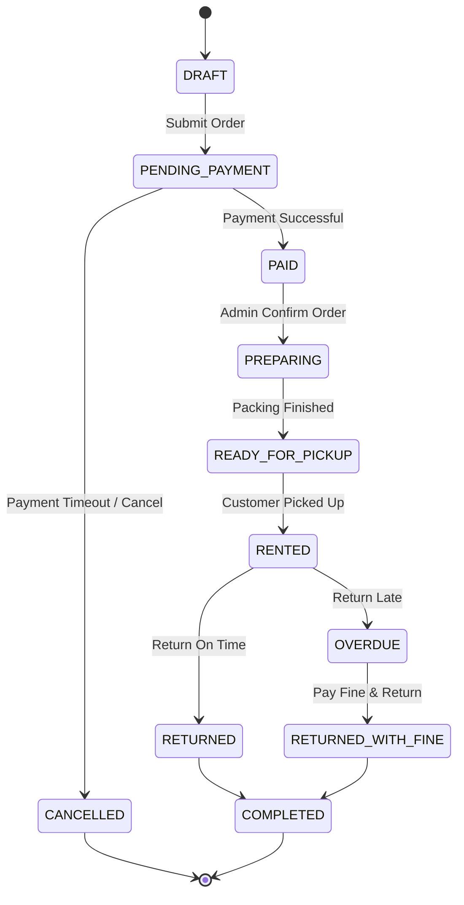

# Rental Order Lifecycle (วงจรชีวิตรายการเช่าชุด)

เอกสารนี้อธิบายถึงลำดับขั้นตอน เงื่อนไข และการเปลี่ยนสถานะของรายการเช่าชุด (Costume Rental Order) ตั้งแต่เริ่มต้นทำรายการจนจบกระบวนการ

---

## 1. Overview of States (สรุปสถานะในระบบ)

| สถานะ (Status) | ความหมาย (Description) | ผู้รับผิดชอบ (Role) |
| :--- | :--- | :--- |
| `DRAFT` | ลูกค้าเลือกชุดและลงวันเช่าแล้ว อยู่ระหว่างรอชำระเงิน | Customer |
| `PENDING_PAYMENT` | รายการเช่าสร้างสำเร็จ รอแจ้งชำระเงิน | Customer |
| `PAID` | ชำระเงินเรียบร้อย รอเจ้าหน้าที่ยืนยันและจัดเตรียมชุด | System / Admin |
| `PREPARING` | ร้านค้ากำลังจัดเตรียมชุด/ทำความสะอาด | Admin |
| `READY_FOR_PICKUP` | จัดเตรียมชุดเสร็จสิ้น พร้อมให้ลูกค้ารับชุด | Admin / Customer |
| `RENTED` | ลูกค้ารับชุดไปใช้งานเรียบร้อยแล้ว | Customer |
| `RETURNED` | ลูกค้าคืนชุดตรงเวลา สภาพสมบูรณ์ | Admin / Customer |
| `OVERDUE` | คืนชุดเกินกำหนดเวลาที่ระบุในสัญญา | System / Admin |
| `RETURNED_WITH_FINE` | คืนชุดเรียบร้อยพร้อมชำระค่าปรับ | Admin / Customer |
| `CANCELLED` | รายการเช่าถูกยกเลิก | Customer / Admin |
| `COMPLETED` | ปิดรายการเช่าสมบูรณ์ | System |

---

## 2. Lifecycle Transitions (เงื่อนไขการเปลี่ยนสถานะ)

## 3. Detailed Business Rules (กฎทางธุรกิจ)
การจองและการชำระเงิน:

รายการเช่าที่สร้างขึ้นจะมีอายุ PENDING_PAYMENT หากไม่ชำระภายในเวลาที่กำหนด ระบบจะเปลี่ยนสถานะเป็น CANCELLED อัตโนมัติ

การรับและคืนชุด:

ลูกค้าต้องมารับชุดเมื่อสถานะเป็น READY_FOR_PICKUP

การคืนชุดตรงเวลาจะเปลี่ยนสถานะเป็น RETURNED และคืนเงินมัดจำ (ถ้ามี)

การคิดค่าปรับ (Fine Calculation):

หากคืนชุดเกินกำหนด ระบบจะเปลี่ยนเป็น OVERDUE และคำนวณค่าปรับตามจำนวนวันที่เกินจริง

หากชุดเสียหาย จะมีการคิดค่าปรับความเสียหายเพิ่มก่อนเปลี่ยนสถานะเป็น RETURNED_WITH_FINE