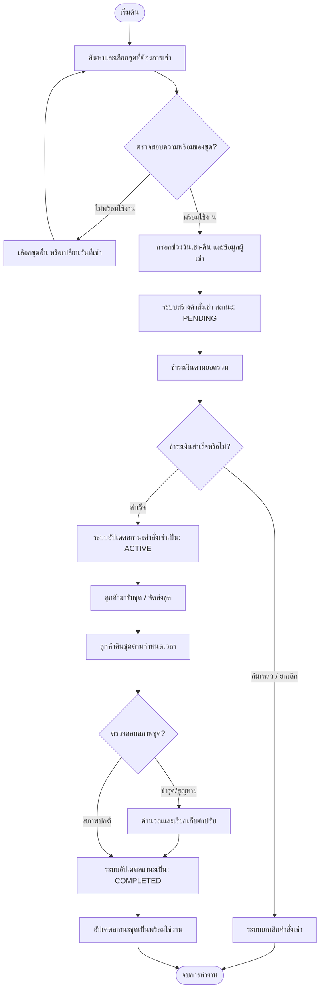

# 5. Activity Diagram

## 5.1 Activity Diagram: Costume Rental & Return Process

## 5.2 Description
Activity Diagram แสดงขั้นตอนการทำงาน (Workflow) ทั้งหมดของกระบวนการเช่าชุด:

การเลือกชุด: ลูกค้าทำการค้นหาและตรวจสอบความพร้อมของชุด

การทำรายการเช่า: หากชุดพร้อมใช้งาน ลูกค้าจะทำการกรอกข้อมูล และระบบจะสร้าง Order

การประมวลผลการชำระเงิน: หากชำระเงินสำเร็จ สถานะเปลี่ยนเป็น ACTIVE

การคืนชุดและตรวจรับ: เมื่อลูกค้านำชุดมาคืน เจ้าหน้าที่ตรวจสอบสภาพชุด หากปกติหรือชำระค่าปรับเรียบร้อยแล้ว ระบบจะอัปเดตสถานะเป็น COMPLETED และเปลี่ยนสถานะชุดกลับมาพร้อมเช่าอีกครั้ง