# 3. Class Diagram & Design Patterns

## 3.1 Class Diagram

```mermaid
classDiagram
    %% Controller Layer
    class CostumeController {
        -CostumeService costumeService
        +getAvailableCostumes() List~Costume~
        +addCostume(CostumeDTO) Costume
    }

    class RentalOrderController {
        -RentalOrderService orderService
        +createOrder(OrderRequestDTO) RentalOrder
        +payOrder(Long orderId, PaymentStrategy strategy) Payment
    }

    %% Service Layer & Interfaces
    class CostumeService {
        <<interface>>
        +findAvailableCostumes() List~Costume~
    }

    class CostumeServiceImpl {
        -CostumeRepository costumeRepository
        +findAvailableCostumes() List~Costume~
    }

    class RentalOrderService {
        <<interface>>
        +createOrder(OrderRequestDTO) RentalOrder
        +processPayment(Long orderId, PaymentStrategy strategy) Payment
    }

    class RentalOrderServiceImpl {
        -RentalOrderRepository orderRepository
        -PaymentContext paymentContext
        +createOrder(OrderRequestDTO) RentalOrder
        +processPayment(Long orderId, PaymentStrategy strategy) Payment
    }

    %% Design Pattern 1: Strategy Pattern (Payment Processing)
    class PaymentStrategy {
        <<interface>>
        +pay(Double amount) boolean
    }

    class CreditCardPayment {
        -String cardNumber
        +pay(Double amount) boolean
    }

    class PromptPayPayment {
        -String qrCode
        +pay(Double amount) boolean
    }

    class PaymentContext {
        -PaymentStrategy strategy
        +executePayment(Double amount) boolean
    }

    %% Design Pattern 2: State Pattern (Order / Costume Status)
    class RentalState {
        <<interface>>
        +nextState(RentalOrder context)
        +cancelOrder(RentalOrder context)
    }

    class PendingState {
        +nextState(RentalOrder context)
        +cancelOrder(RentalOrder context)
    }

    class ActiveRentalState {
        +nextState(RentalOrder context)
        +cancelOrder(RentalOrder context)
    }

    %% Relationships
    CostumeController --> CostumeService
    RentalOrderController --> RentalOrderService
    CostumeServiceImpl ..|> CostumeService
    RentalOrderServiceImpl ..|> RentalOrderService

    RentalOrderServiceImpl --> PaymentContext
    PaymentContext o-- PaymentStrategy
    CreditCardPayment ..|> PaymentStrategy
    PromptPayPayment ..|> PaymentStrategy

    PendingState ..|> RentalState
    ActiveRentalState ..|> RentalState

```

## 3.2 Design Patterns Implemented
Strategy Pattern (การชำระเงิน): แยกอัลกอริทึมการชำระเงินออกเป็น Class ย่อย เช่น CreditCardPayment, PromptPayPayment เพื่อรองรับช่องทางจ่ายเงินใหม่ๆ ได้สะดวก

State Pattern (การเปลี่ยนสถานะการเช่า): ใช้จัดการวงจรชีวิตของคำสั่งเช่า (PENDING -> ACTIVE -> RETURNED) ให้เป็นระเบียบและจัดการเงื่อนไขในแต่ละสถานะได้ง่าย

Repository/Service Pattern: แบ่งโครงสร้างซอฟต์แวร์ตามหลัก Layered Architecture (Controller, Service, Repository)