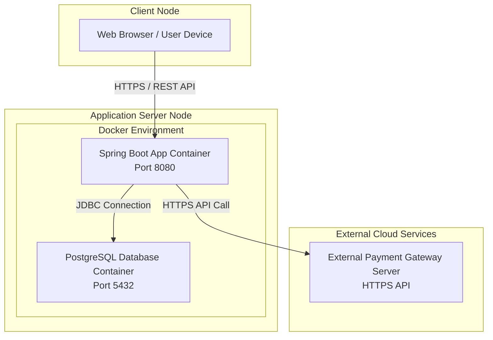

# 8. Deployment Diagram

## 8.1 Deployment Diagram

## 8.2 Deployment Description
Deployment Diagram แสดงโครงสร้างการติดตั้งระบบบนสภาพแวดล้อมจริง (Deployment Environment):

Client Node: อุปกรณ์ของผู้ใช้งานที่เชื่อมต่อผ่าน Web Browser ผ่านโปรโตคอล HTTPS

Application Server Node: เซิร์ฟเวอร์หลักที่รันแอปพลิเคชันผ่าน Docker Container ประกอบด้วย:

Spring Boot App Container: ส่วนประมวลผล Backend รันอยู่บน Port 8080

PostgreSQL DB Container: ส่วนจัดการและจัดเก็บข้อมูล รันอยู่บน Port 5432

External Cloud Services: บริการภายนอกที่เชื่อมต่อผ่าน HTTPS REST API เพื่อประมวลผลการชำระเงินออนไลน์