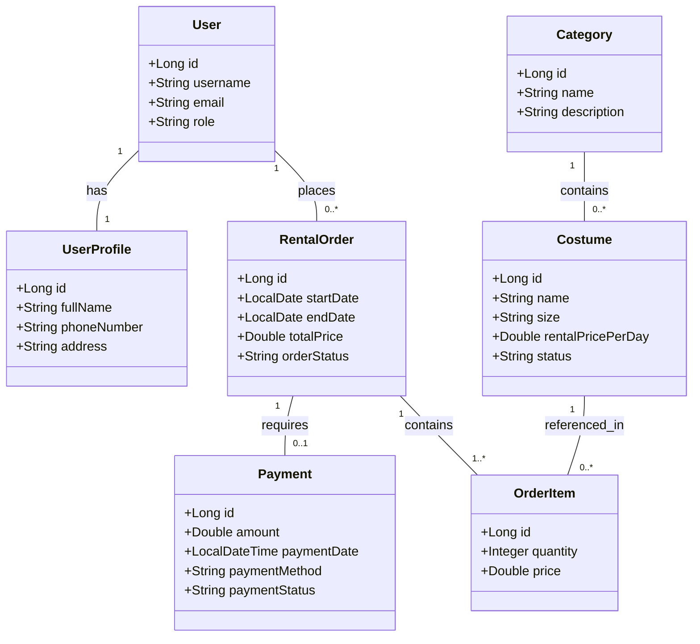

# 2. Domain Model / Conceptual Class Diagram

## 2.1 Domain Model Diagram

## 2.2 Conceptual Description

Domain Model นี้แสดง Entity หลักของระบบ Costume Rental System และความสัมพันธ์ระหว่าง Entity ต่างๆ เช่น:

User & UserProfile: ผู้ใช้งาน 1 คนมีโปรไฟล์ 1 โปรไฟล์

Category & Costume: หมวดหมู่ชุด 1 หมวดหมู่ประกอบด้วยชุดหลายชุด

RentalOrder & OrderItem: คำสั่งเช่า 1 คำสั่ง ประกอบด้วยรายการชุดที่เช่า (OrderItem) 1 รายการขึ้นไป

RentalOrder & Payment: คำสั่งเช่าเชื่อมโยงกับการชำระเงิน (Payment)

