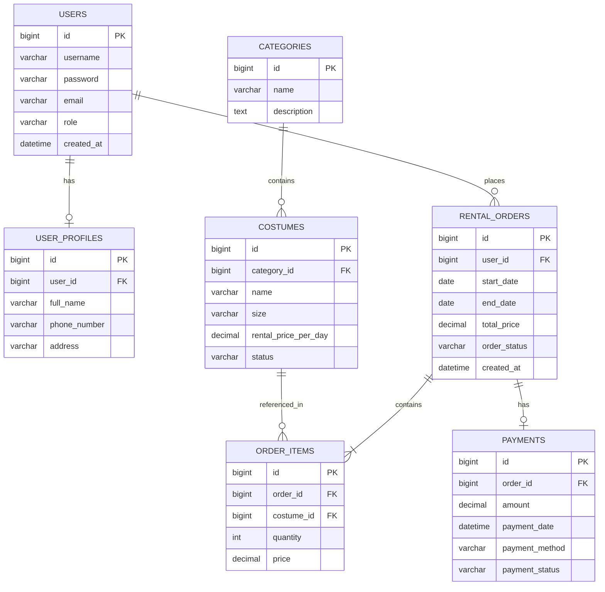

# 6. Entity Relationship Diagram (ER Diagram)

## 6.1 ER Diagram

## 6.2 Database Structure Description
ตารางฐานข้อมูลหลักของระบบประกอบด้วย:

USERS & USER_PROFILES (1:1): ตารางผู้ใช้งานและข้อมูลส่วนตัว

CATEGORIES & COSTUMES (1:N): หมวดหมู่ชุดแต่งกายและรายการชุด

RENTAL_ORDERS & ORDER_ITEMS (1:N): ตารางคำสั่งเช่าชุดและรายการรายละเอียดชุดที่เช่า

RENTAL_ORDERS & PAYMENTS (1:1): ตารางคำสั่งเช่าและประวัติการชำระเงิน