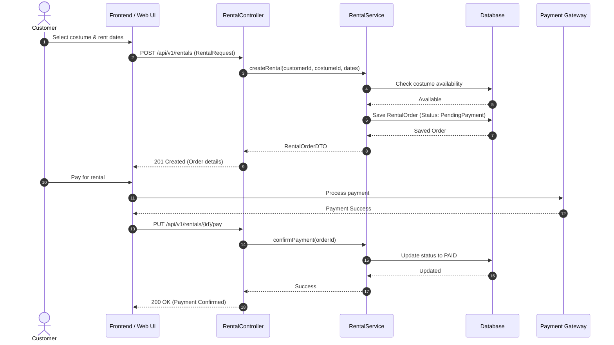
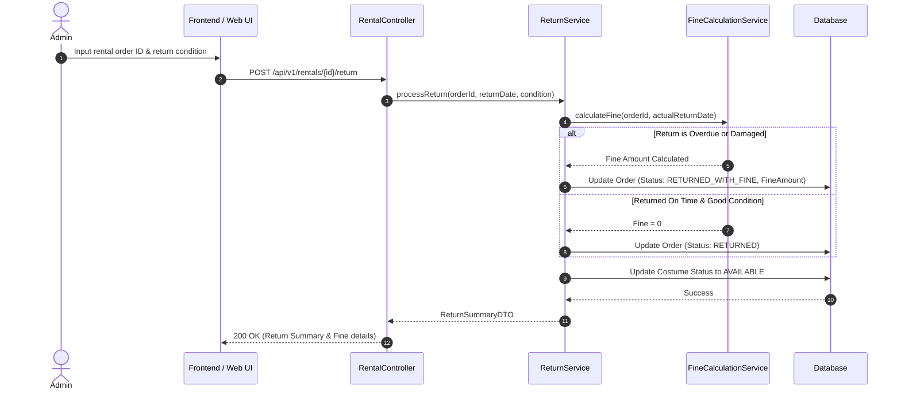
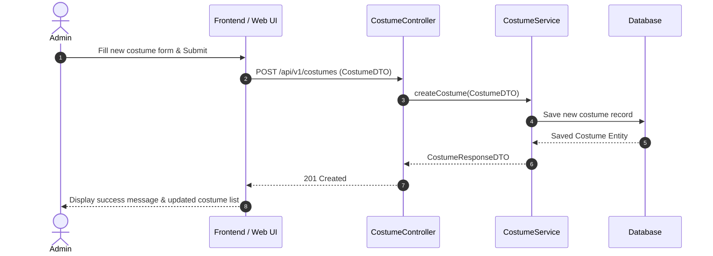

# 4. Sequence Diagrams

## 4.1 Rental & Payment Process (การเช่าชุดและการชำระเงิน)

## 4.2 Costume Return & Fine Calculation Process (การคืนชุดและการคำนวณค่าปรับ)

## 4.3 Costume Management Process by Admin (การจัดการข้อมูลชุดโดยผู้ดูแลระบบ)

