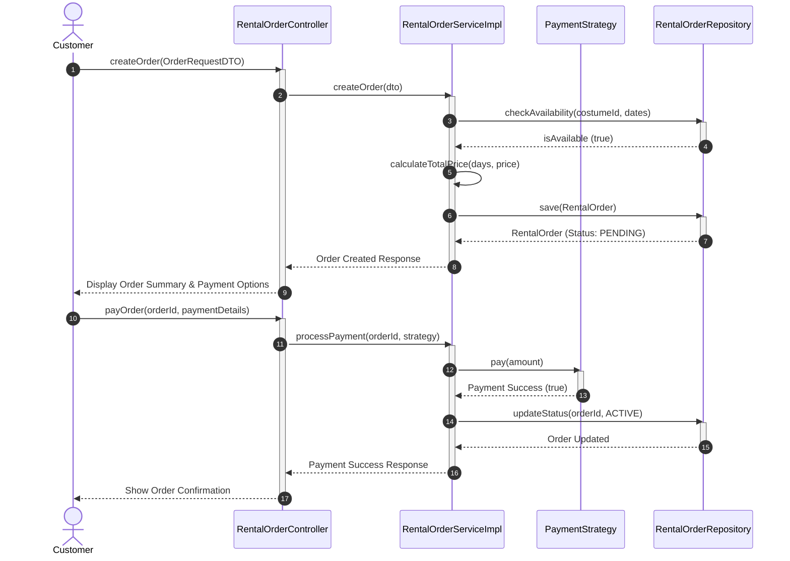

# 4. Sequence Diagram

## 4.1 Sequence Diagram: Create Rental Order & Payment

## 4.2 Description

ลำดับขั้นตอนการทำงานของการเช่าชุดและการชำระเงิน (Create Rental Order & Process Payment):

การสร้างคำสั่งเช่า: ลูกค้าส่งคำร้องขอสร้างคำสั่งเช่าผ่าน RentalOrderController

การตรวจสอบความพร้อม: ระบบตรวจสอบความพร้อมของชุดในฐานข้อมูล หากว่าง จะคำนวณราคารวมและบันทึกคำสั่งเช่าสถานะ PENDING

การชำระเงิน: ลูกค้าเลือกวิธีการชำระเงิน และระบบประมวลผลผ่าน PaymentStrategy (Strategy Pattern)

การยืนยัน: เมื่อชำระเงินสำเร็จ ระบบจะอัปเดตสถานะการเช่าเป็น ACTIVE และส่งผลยืนยันกลับไปยังลูกค้า