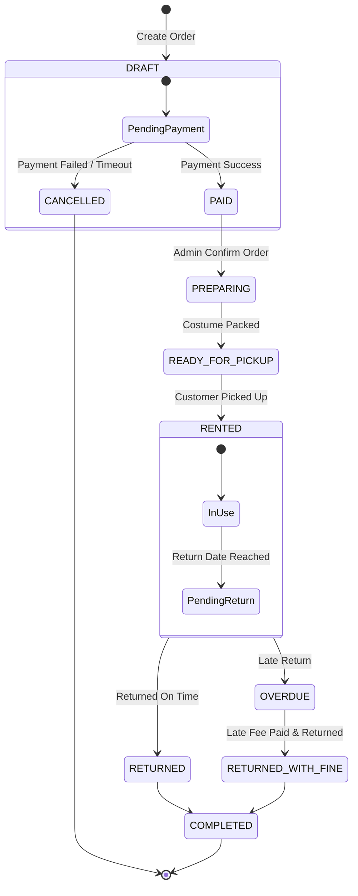

# 9. State Diagram

## 9.1 Rental Order State Diagram

## 9.2 State Description
State Diagram แสดงวงจรชีวิตและสถานะของรายการเช่าชุด (Rental Order Lifecycle):

DRAFT / PendingPayment: สร้างรายการเช่าและรอการชำระเงิน

PAID: ชำระเงินเรียบร้อย รอเจ้าหน้าที่จัดเตรียมชุด

PREPARING / READY_FOR_PICKUP: เตรียมชุดเสร็จสิ้น พร้อมให้ลูกค้ารับชุด

RENTED / InUse: ลูกค้าอยู่ระหว่างการนำชุดไปใช้งาน

RETURNED: คืนชุดตรงเวลา สถานะเสร็จสมบูรณ์ (COMPLETED)

OVERDUE / RETURNED_WITH_FINE: คืนชุดเกินกำหนด คิดค่าปรับ และเปลี่ยนสถานะเป็นเสร็จสมบูรณ์เมื่อชำระค่าปรับครบถ้วน