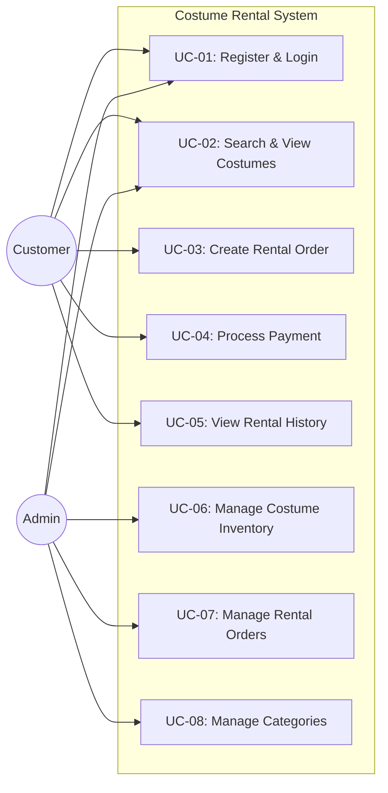

# 1. Use Case Diagram & Description

## 1.1 Use Case Diagram

## 1.2 Use Case Description

### UC-03: Create Rental Order
- **Actor:** Customer
- **Precondition:** ลูกค้าเข้าสู่ระบบ (Logged in) เรียบร้อยแล้ว
- **Postcondition:** ระบบบันทึกคำสั่งเช่าชุด มีสถานะเป็น `PENDING` และรอการชำระเงิน
- **Main Flow:**
  1. ลูกค้าเลือกชุดแต่งกายที่ต้องการ และระบุวันเริ่มเช่า - วันคืนชุด
  2. ระบบตรวจสอบสถานะความพร้อมของชุดในระบบ (Costume Availability)
  3. ระบบคำนวณราคารวม (Total Price)
  4. ลูกค้ายืนยันการเช่า
  5. ระบบสร้าง `RentalOrder` และเปลี่ยนสถานะชุดชั่วคราว